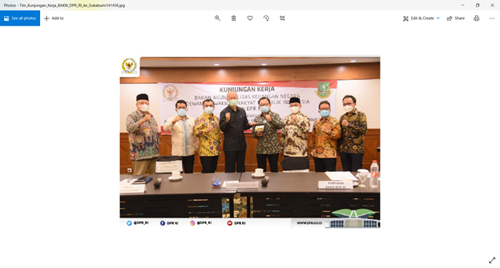

# Lapres Praktikum Jarkom Modul 1

## 1

### Soal

### Jawaban

## 2

### Soal
Simpan gambar "Tim_Kunjungan_Kerja_BAKN_DPR_RI_ke_Sukabumi141436.jpg"

### Jawaban
- Buka File > Export Objects > HTTP
- Kemudian di Text Filter masukkan nama file.
- Save file dengan extensi .jpg

## 3

### Soal

### Jawaban

## 4

### Soal
Temukan paket dari web-web yang menggunakan basic authentication method!

### Jawaban
- Masukkan **http.authorization contains Basic** ke Display Filter

## 5

### Soal

### Jawaban

## 6

### Soal
Seseorang menyimpan file zip melalui FTP dengan nama "Answer.zip". Simpan dan Buka file "Open This.pdf" di Answer.zip. Untuk mendapatkan password zipnya, temukan dalam file zipkey.txt (passwordnya adalah isi dari file txt tersebut).

### Jawaban
- Masukkan **ftp-data.command contains zipkey.txt** ke Display Filter
- Klik kanan pada paket, kemudian Follow > TCP Stream, diubah jadi RAW dan disimpan dengan ekstensi .txt
- Buka file .txt untuk mendapatkan password.
- Kemudian masukkan **ftp-data.command contains Answer.zip** ke Display Filter
- Klik kanan pada salah satu paket, kemudian Follow > TCP Stream, diubah jadi RAW dan disimpan dengan ekstensi .zip
- Ekstrak file .zip dan masukkan password untuk mendapatkan isi .zip.

## 7

### Soal

### Jawaban

## 8

### Soal
Cari objek apa saja yang didownload (RETR) dari koneksi FTP dengan Microsoft FTP Service!

### Jawaban
- Masukkan **frame contains "Microsoft FTP"** ke dalam Display Filter untuk mencari IP dari Microsoft FTP Service.
- Masukkan **ftp.request.command contains RETR && ip.dst == 198.246.117.106** ke dalam Display Filter untuk mencari objek yang didownload.

## 9

### Soal

### Jawaban

## 10

### Soal
Cari file .pdf di wireshark lalu download dan buka file tersebut!

### Jawaban
- Buka menu find (CTRL + F) lalu masukkan Hex Code 25 50 44 46.
- Klik kanan pada paket yang di highlight, kemudian Follow > TCP Stream, diubah jadi RAW dan disimpan dengan ekstensi .pdf

## 11

### Soal

### Jawaban

## 12

### Soal
Filter sehingga wireshark hanya mengambil paket yang berasal dari port 80!

### Jawaban
- Masukkan **src port 80** di Capture Filter.

## 13

### Soal

### Jawaban

## 14

### Soal
Filter sehingga wireshark hanya mengambil paket yang berasal dari ip kalian!

### Jawaban
- Buka Comman Prompt, masukkan perintah ipconfig untuk mendapat alamat IP sendiri (192.168.1.16 untuk hasilnya)
- Masukkan **src port 192.168.1.16** di Capture Filter.

## 15

### Soal

### Jawaban
